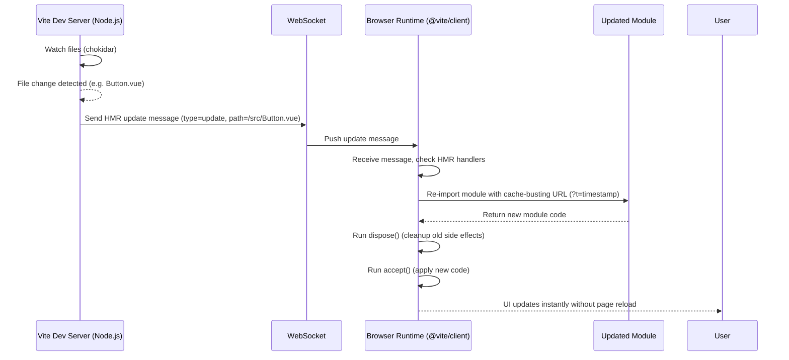

# Vite and the Frontend Toolchain

As a backend developer, it helps to think of frontend tools in terms of a **toolchain**.  
Just like the backend world has compilers, frameworks, dependency managers, and servers, the frontend world has its own layers.

---

## 🛠️ The Frontend Toolchain (Conceptual Map)

1. **Package Manager**  
   - Manages dependencies.  
   - In JS land: `npm`, `yarn`, `pnpm`.  

2. **Project Scaffolding**  
   - Bootstraps a project with the right files and configs.  
   - Example: `npm create vite@latest my-project`.  

3. **Dev Server**  
   - Serves files during development.  
   - Supports hot reload so changes appear instantly in the browser.  

4. **Transpilers / Compilers**  
   - Convert “future” or non-standard code into browser-compatible JS.  
   - Example: TypeScript → JavaScript, JSX → JS.  

5. **Bundler / Optimizer**  
   - Gathers all JS, CSS, images into optimized production bundles.  
   - Handles tree-shaking, minification, code-splitting.  

6. **Plugins / Extensions**  
   - Add support for frameworks (Vue, React), preprocessors (Sass, Markdown), or optimizations (PWA, Tailwind).  

---

## ⚡ Where Vite Fits

Vite bundles several of these responsibilities into one tool:

- **Project Scaffolding** → via `create-vite` (`npm create vite@latest`).  
- **Dev Server** → instant startup, hot module replacement (HMR).  
- **Bundler** → optimized production builds (uses Rollup/Rolldown under the hood).  
- **Plugin System** → extensible pipeline (for frameworks, CSS processors, assets).  

So Vite = **scaffolder + dev server + bundler + plugin system**.

---

## 🔧 The Create Command

```sh
npm create vite@latest my-project
```

- **`npm create`** → runs a scaffolding tool (similar to `npx`).  
- **`vite@latest`** → fetches the latest `create-vite` package.  
- **`my-project`** → target directory for the new project.  

### Flow
1. Prompts you to choose a framework (Vanilla, Vue, React, Svelte, etc.).  
2. Prompts for language (JavaScript or TypeScript).  
3. Generates a minimal project structure:
   ```
   my-project/
   ├── index.html
   ├── package.json
   ├── vite.config.ts
   └── src/
   ```
4. Next steps:
   ```sh
   cd my-project
   npm install
   npm run dev
   ```

---

## 🔌 Vite Plugins

- **What they are:** Modular extensions that hook into the dev server + build process.  
- **Why they exist:** To adapt Vite to different frameworks, languages, and workflows.  
- **Examples:**  
  - Framework → Vue (`@vitejs/plugin-vue`), React (`@vitejs/plugin-react`).  
  - Styling → Tailwind (`@tailwindcss/vite`), Sass, PostCSS.  
  - Enhancements → PWA, file-based routing, inspector/debugging tools.  

Think of plugins like **middleware** in backend frameworks — they extend the pipeline.

---

## 🌐 The Big Picture

- **Without tools** → you’d write raw HTML, CSS, JS and load them directly in the browser.  
- **With a toolchain** → you use TypeScript, modern JS, frameworks (Vue/React), and advanced styling (Tailwind, Sass). These need compilation, bundling, and optimization before shipping to production.  
- **Vite’s role** → it ties these steps together with sensible defaults and modern speed.  

---

👉 In short:  
Vite is the **orchestrator** of the modern frontend toolchain. It scaffolds projects, runs a dev server, bundles code for production, and extends through plugins.


```plain

Package Manager (npm, yarn, pnpm)
        │
        ▼
Project Scaffolding (create-vite)
        │
        ▼
   Dev Server (HMR)
        │
        ▼
Transpilers (TS, JSX)
        │
        ▼
Bundler / Optimizer (Rollup/Rolldown)
        │
        ▼
 Production Build
        ▲
        │
   Plugins (Vue, React, Tailwind, PWA)
```
## 🔥 Hot Module Replacement (HMR)

HMR = **Hot Module Replacement**. It lets you update parts of your app while it’s running **without doing a full page reload**.

- You edit a file → Vite recompiles just that file.  
- The dev server notifies the browser via WebSocket.  
- The browser’s Vite runtime fetches the new module and swaps it in.  
- If the module accepts HMR (`import.meta.hot`), only that part updates.  
- If not, Vite falls back to a full reload.  

### Why It Matters
- **Fast feedback loop** → no waiting for a full rebuild.  
- **State preserved** → form inputs, scroll position, app state stay intact.  

### Browser vs. Vite
- Browsers support **ES Modules**, but **do not have HMR built in**.  
- **Vite implements HMR**:  
  - Watches files for changes.  
  - Pushes updates to the browser over WebSocket.  
  - Handles module swapping through its runtime client.  

### Backend Analogy
Think of HMR like **incremental compilation or hot class swapping** on the backend:

| Backend Concept              | Frontend with Vite + HMR       |
|-------------------------------|--------------------------------|
| Full rebuild & server restart | Full page reload               |
| Incremental compilation       | Rebuild just the changed file  |
| Hot code swap (e.g. JRebel)   | Hot Module Replacement (HMR)   |

👉 In short: HMR is a feature of **Vite’s dev server**, not the browser. It surgically replaces changed modules in the running app, keeping the rest of the app alive.

## 🖥️ On the Vite Dev Server (Node.js process)

1. **Serve entry files**
   - Vite serves `index.html` as is (unbundled).
   - When the browser requests JS modules, Vite transforms them on demand (TypeScript → JS, JSX → JS, Vue SFC → JS, etc.).

2. **Maintain a module graph**
   - Vite builds an in-memory graph of which files import which.
   - This lets it trace dependencies (like `App.vue → Button.vue → utils/date.ts`).

3. **Watch for changes**
   - Uses file system watchers (chokidar) to detect changes in source files.

4. **Invalidate cache + trigger HMR**
   - When a file changes, Vite invalidates that module in its cache.
   - It decides what kind of update to send (JS update, CSS update, or full reload).
   - Sends an HMR message via **WebSocket** to all connected browsers.

---

## 🌐 In the Browser (Vite runtime client, `@vite/client`)

1. **Connect via WebSocket**
   - The dev server injects a tiny runtime script into the page.
   - That script opens a WebSocket connection back to the Vite dev server.

2. **Listen for HMR messages**
   - Messages include things like:
     - `"update"` → reload this module.
     - `"css-update"` → replace a CSS file link.
     - `"full-reload"` → refresh the entire page.

3. **Re-import updated modules**
   - The runtime calls `import(newUrl)` with a cache-busting query string (`?t=12345`).
   - This ensures the browser fetches the latest version of the file.

4. **Apply or bubble updates**
   - If the module calls `import.meta.hot.accept`, the runtime executes the callback with the new version.
   - If not, the update bubbles up to parent modules in the graph.
   - If no one accepts → full page reload.

5. **Handle cleanup**
   - If a module registered a `dispose` handler, it’s run before replacement (e.g., to clear timers or event listeners).

---

## ⚖️ Division of Labor

- **Server side (Vite dev server):**
  - Watches files.
  - Transforms code into ESM.
  - Maintains the dependency graph.
  - Pushes update instructions over WebSocket.

- **Client side (Vite browser runtime):**
  - Keeps the WebSocket open.
  - Listens for update messages.
  - Re-imports changed modules.
  - Applies them via the HMR API (`accept`, `dispose`).

---

## 🧠 Mental Model (Backend Analogy)

- **Server side = like a compiler + hot reload coordinator**  
  Watches files, recompiles just what changed, and sends notifications.

- **Browser side = like a lightweight runtime agent**  
  Receives new code, swaps it in, and runs callbacks — similar to how JRebel or Spring DevTools inject recompiled classes into a running JVM.

---

👉 In short:  
- **Vite server** = watches + transforms + notifies.  
- **Browser runtime** = listens + re-imports + swaps modules.  

## 🔄 Vite HMR Flow (Server ↔ Browser)

### Mermaid Diagram

